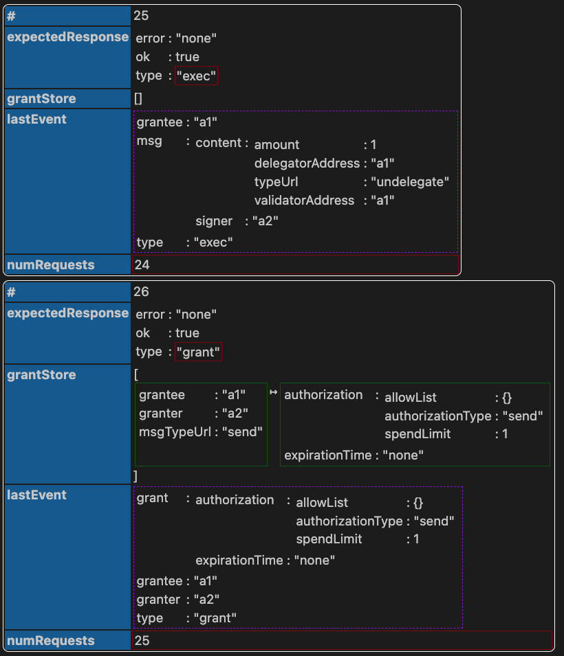
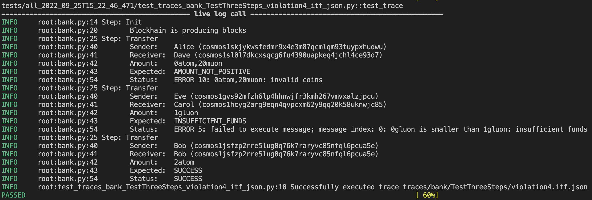

Atomkraft-powered Test Suite for Cosmos blockchains
===

[Atomkraft](https://github.com/informalsystems/atomkraft) is a tool for E2E testing of Cosmos SDK blockchains. The distinctive characteristic of Atomkraft tests is that they are _model-based_: a TLA+ model is currently needed to automatically generate the test scenarios. But as soon as the model is in place, massive test suites can be generated and executed against the real blockchain at a press of a button, thanks to the power provided to you by Atomkraft and our in-house model checker [Apalache](https://apalache.informal.systems).

**In this repository, we have started a collective effort of providing the Cosmos community with Atomkraft-powered standard test suite for Cosmos SDK modules.** Our final goal is to provide any Cosmos SDK compatible blockchain with the ability to integrate this test suite into their CI, thus ensuring that the core functionality of Cosmos SDK works as expected in the context of the respective blockchain.

| ⚠️ The repository is very much work-in-progress; we are constantly refining and restructuring it. **The test suite is not yet production ready.** Please feel free to experiment, but problems and errors are to be expected. ⚠️ |
| ---------------------------------------------------------------------------------------------- |

## Installation

1. Please install Atomkraft by following it's [Installation Guide](https://github.com/informalsystems/atomkraft/blob/dev/INSTALLATION.md) to correctly install all dependencies.

2. Clone Atomkraft-cosmos repo.
    ```sh
    git clone https://github.com/informalsystems/atomkraft-cosmos
    cd atomkraft-cosmos
    ```

3. The repo comes preconfigured to use Cosmos SDK binary (`simd`); Cosmos SDK repository is included as Git submodule in this repo.
    ```sh
    git submodule update --init --recursive
    (cd cosmos-sdk; make build)
    ```

4. (Skip this step if using vanilla Cosmos SDK) If you want to test a custom Cosmos SDK compatible blockchain binary, then you need to have it locally on your machine. Please update the [Atomkraft chain config](chain.toml) either manually, or by using these commands:
    ```sh
    atomkraft chain config prefix <YOUR-PREFIX>
    atomkraft chain config binary <PATH-TO-YOUR-BINARY>
    atomkraft chain config denom <YOUR-DENOM>
    ```

    **NB!: Due to technical difficulties, using Atomkraft-Cosmos with binaries other than `simd` might not work at the moment; we are working on a solution** 

5. Make sure you can run your blockchain binary using Atomkraft by issuing this command `atomkraft chain testnet`. If it works, you are ready to go!

## Running the tests

We have started to populate this repository with model-based tests for Cosmos SDK; insofar we are targeting [Bank](https://github.com/cosmos/cosmos-sdk/tree/main/x/bank) and [Authz](https://github.com/cosmos/cosmos-sdk/tree/main/x/authz) modules. For illustration purposes we use the `Bank` module tests below.

Assuming you have performed the installation steps described above, running the test suite is as easy as running

```sh
pytest
```

Yes, that's right: this repository is the Cosmos SDK test suite that is ready to be integrated into your CI: no TLA+ knowledge is needed. If this is what you want -- take it "as is". If you want to generate or execute your own tests, continue reading.

### Describing your test intentions & generating tests

For the `Bank` module, we have created a simple [TLA+ model](models/bank/BankSend.tla) that describes transfers of coins between user wallets. Tests are described as _TLA+ test assertions in [BankSendTests.tla](models/bank/BankSendTests.tla) file; please consult it for some instructions on how to write them. A typical test assertion consists of a few lines of TLA+, and can be used (together with the TLA+ model) to generate a multitude of tests. E.g. the test assertion below asks for any trace that contains 3 steps (transactions)

```tla
TestThreeSteps == step = 3
```


while the command

```sh
atomkraft model sample --model-path models/bank/BankSendTests.tla --examples TestThreeSteps --traces-dir traces/bank --max_error=10 --view=OutcomeView
```

should generate 10 abstract traces that satisfy the `TestThreeSteps` test assertion; the traces will be saved in the [traces/bank/TestThreeSteps](traces/bank/TestThreeSteps/) folder. the `--view` argument specifies the criterion according to which the generated traces should differ. In that case we use `OutcomeView == outcome`, which says that different transaction outcomes should be generated.


### Understanding abstract test traces

The traces obtained from TLA+ model are generated in the [Informal Trace Format (ITF)](https://apalache.informal.systems/docs/adr/015adr-trace.html), which is a JSON format well-suited for storing abstract test scenarios. To ease trace understanding, we have also developed [ITF Trace Viewer](https://marketplace.visualstudio.com/items?itemName=informal.itf-trace-viewer) VSCode plugin. We highly recommend installing it; it can display them nicely formatted, as shown below for a trace generated for the `Authz` module.



### Running generated traces against blockchain

When you have generated enough traces, you can run them against the blockchain using the command below:

```sh
atomkraft test trace --path traces/bank/TestThreeSteps --reactor reactors/bank.py --keypath action.tag
```

Under the hood, the command generates `Pytest` test scripts that load the ITF trace, and run it. The transformation of abstract test data into concrete transactions is done in the so called _reactor_; in this case the reactor [reactors/bank.py](reactors/bank.py) describes how to execute steps that perform bank sends.

The tests are executed live, and should produce the output like the one below.




When you execute a command like the one above, test scripts are generated in a new directory under [tests](tests/). We have pre-generated a number of such test scripts already, in particular the scripts in [tests/bank/TestThreeSteps](tests/bank/TestThreeSteps/) have been generated from the `TestThreeSteps` test assertion. To re-execute this particular set of test scripts instead of all generated scripts you may run

```sh
pytest tests/bank/TestThreeSteps
```

## Connect with us!

If you are interested to 
- contribute to this community effort
- integrate the standard Cosmos SDK test suite developed here into the CI of your project
- employ `Atomkraft` for testing your code
- create a project-specific model-based test suite for achieving high coverage of your code

please drop us an email to `hello@informal.systems`; we are looking forward to hear from you!