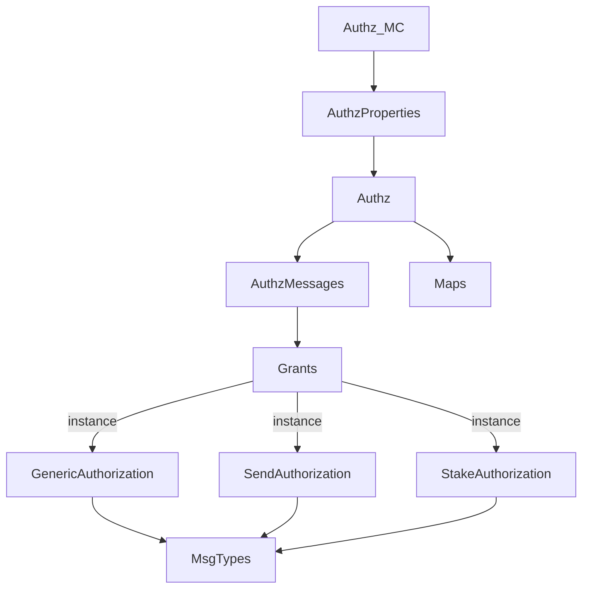

# Module dependency graph

```mermaid
flowchart TB
    Authz_MC --> AuthzProperties --> Authz --> AuthzMessages --> Grants
    Authz --> Maps
    Grants -->|instance| GenericAuthorization & SendAuthorization & StakeAuthorization --> MsgTypes
```
