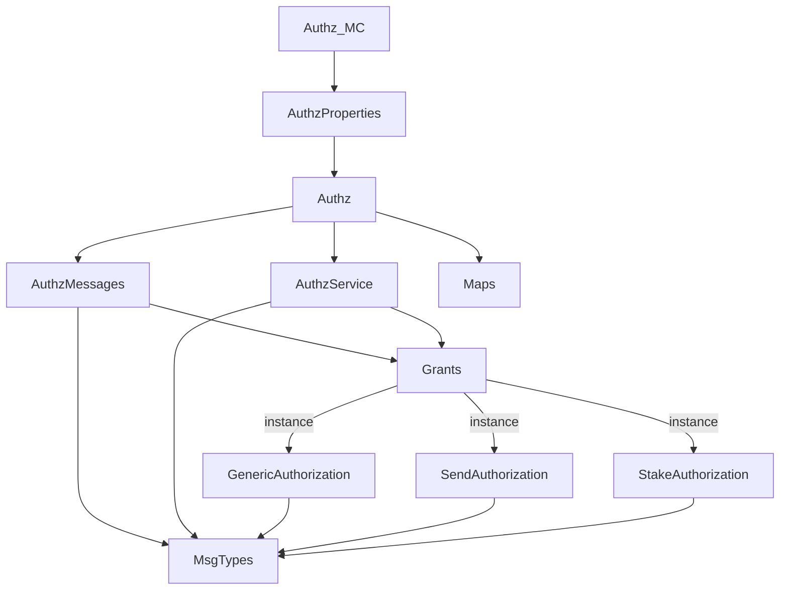

# Module dependency graph

```mermaid
flowchart TB
    Authz_MC --> AuthzProperties --> Authz --> AuthzMessages --> Grants & MsgTypes
    Authz --> AuthzService & Maps
    AuthzService --> MsgTypes
    AuthzService --> Grants -->|instance| GenericAuthorization & SendAuthorization & StakeAuthorization --> MsgTypes
```
