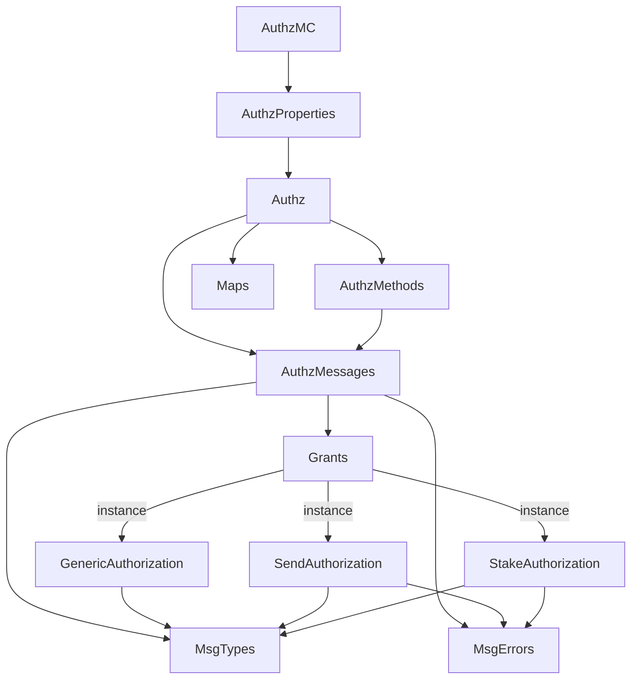

# Module dependency graph

```mermaid
flowchart TB
    AuthzMC --> AuthzProperties --> Authz --> AuthzMethods & AuthzMessages & Maps
    AuthzMethods --> AuthzMessages --> MsgTypes & MsgErrors & Grants
    Grants -->|instance| GenericAuthorization & SendAuthorization & StakeAuthorization --> MsgTypes
    SendAuthorization & StakeAuthorization --> MsgErrors
```
